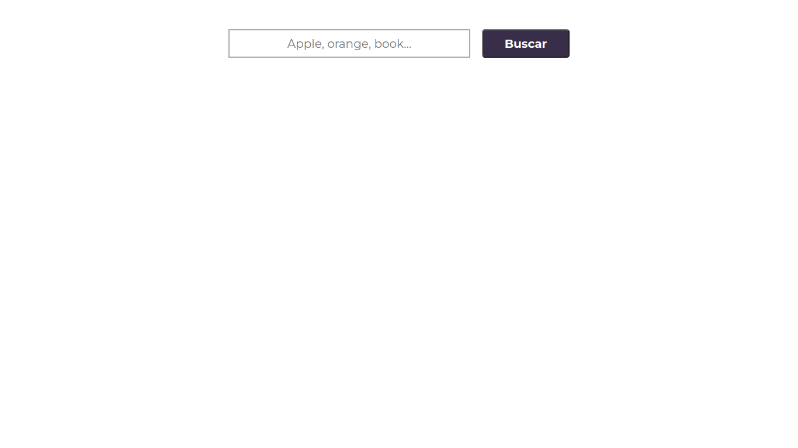
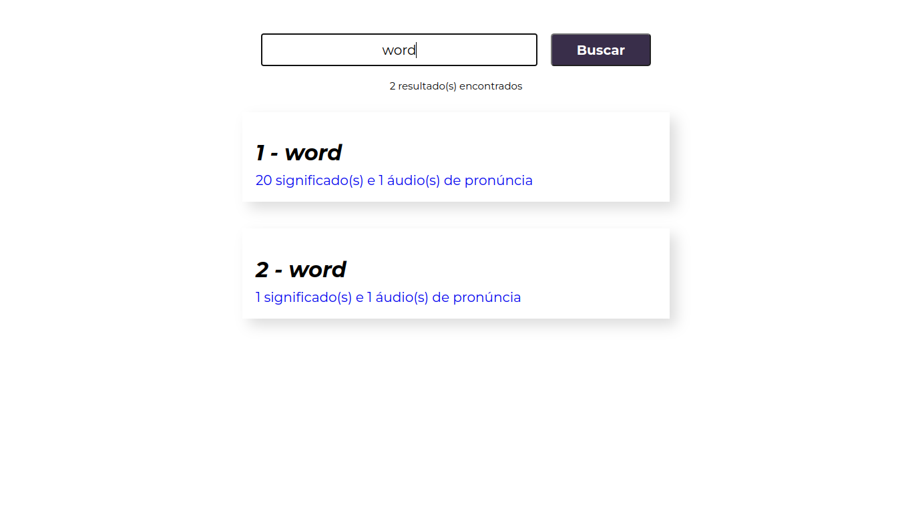
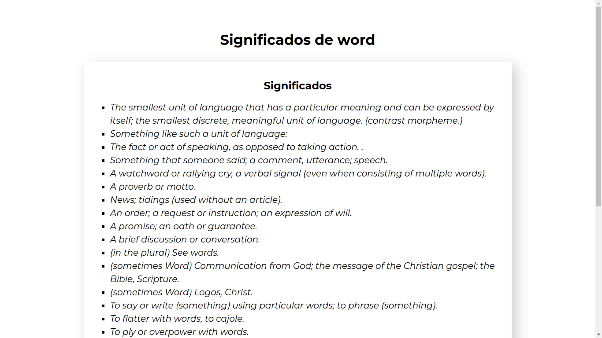
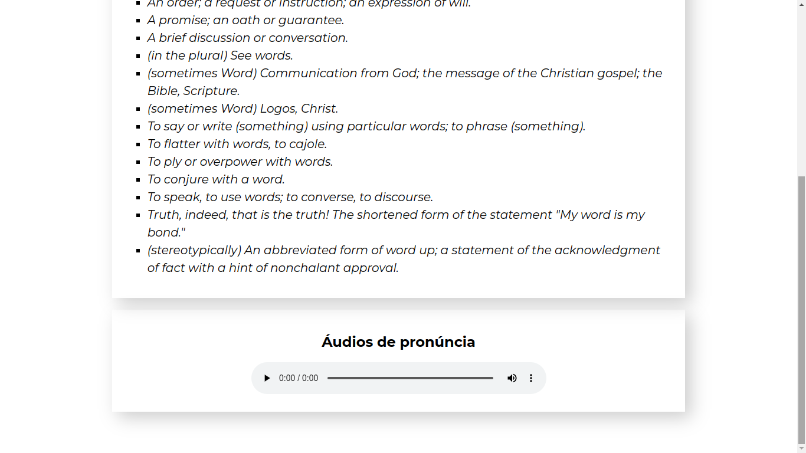

# evolved-dictionary

## Sumário

- [evolved-dictionary](#evolved-dictionary)
  - [Sumário](#sumário)
  - [Motivação](#motivação)
  - [Pilha de tecnologia](#pilha-de-tecnologia)
  - [Galeria](#galeria)
  - [Como rodar](#como-rodar)
    - [Pré-requisitos](#pré-requisitos)
    - [Passo a passo](#passo-a-passo)

## Motivação

Este app consiste em um dicionário de palavras em língua inglesa. A mesma API, [Free Dictionary](https://dictionaryapi.dev/), foi utilizada no repositório de código [dict-ts](https://github.com/mdccg/dict-ts/) da unidade curricular Construção de Páginas Web III. Eis sua descrição:

> Este app consiste em um dicionário de palavras em língua inglesa utilizando a API Free Dictionary. O app, como exemplificado pelas figuras abaixo, exibe todas as classes gramaticais de uma palavra cadastrada em sua base de dados, um ou mais exemplos práticos para cada classe gramatical e uma lista de sinônimos e antônimos para cada exemplo prático.

Entretanto, este dicionário também tem a opção de reproduzir as pronúncias da palavra pesquisada, _feature_ que o dicionário anterior não tinha.

Este foi o quarto repositório de código apresentado no [Curso Superior de TSI do IFMS](https://www.ifms.edu.br/campi/campus-aquidauana/cursos/graduacao/sistemas-para-internet/sistemas-para-internet) como requisito para obtenção da nota parcial das atividades da unidade curricular Construção de Páginas Web IV.

| [&larr; Repositório anterior](https://github.com/mdccg/color-panel/) | [Próximo repositório &rarr;](#) |
|-|-|

## Pilha de tecnologia

As seguintes tecnologias foram utilizadas para desenvolver este app:

| Papel | Tecnologia |
|-|-|
| Ambiente de execução | [Node](https://nodejs.org/en/) |
| Linguagem de programação | [TypeScript](https://www.typescriptlang.org/) |
| Biblioteca de interface de usuário | [React](https://reactjs.org/) |
| Empacotador de módulos | ~~[Vite](https://vitejs.dev/)~~[<sup>1</sup>](#nota-de-rodape-1) [create-react-app](https://create-react-app.dev/) |
| Framework de teste | [Cypress](https://www.cypress.io/) |
| Base de dados | [Free Dictionary](https://dictionaryapi.dev) |

<sup id="nota-de-rodape-1">1</sup> Devido a um [problema](https://github.com/cypress-io/cypress/issues/26149) de compatibilidade entre o empacotador de módulos Vite versão 4.2.0 e o framework Cypress, todo o projeto foi refatorado pelo professor (fora do horário de aula) com o empacotador de módulos oficial do React, create-react-app.

## Galeria






## Como rodar

### Pré-requisitos

- [Node](https://nodejs.org/en/download/);
- [Yarn](https://yarnpkg.com/) (opcional);
- [`http-server`](https://npmjs.com/package/http-server) ou quaisquer ferramentas de servidores HTTP estáticos.

### Passo a passo

1. Clone o repositório de código em sua máquina;

2. Abra um shell de comando de sua preferência (prompt de comando, PowerShell, terminal _etc_.);

3. Instale as dependências do projeto através do seguinte comando:

```console
$ npm install
```

Caso esteja utilizando o gerenciador de pacotes Yarn, execute o seguinte comando como alternativa:

```console
$ yarn
```

4. A próxima etapa é disponibilizar o seguinte projeto em um servidor HTTP estático. Como sugestão, você pode usar o módulo do npm [`http-server`](https://npmjs.com/package/http-server), que pode ser instalado globalmente via npm ou Yarn e subirá um servidor na porta `8080` visível para toda a sua rede. Sinta-se à vontade para utilizar uma ferramenta de sua preferência, mas não se esqueça de atualizar a propriedade `baseUrl` no arquivo [`cypress.config.ts`](./cypress.config.ts);

5. Execute o Cypress através do seguinte comando:

Para npm:

```console
$ npm run cy:open
```

Para Yarn:

```console
$ yarn cy:open
```

6. O comando acima abrirá uma janela do Cypress solicitando que selecione o tipo de teste: E2E (teste de ponta a ponta) e Component (teste de componente). Selecione a opção desejada;

7. Selecionada a opção desejada, será solicitado que selecione um navegador web para executar os testes. É recomendado selecionar o navegador Electron, pois o mesmo foi desenvolvido pelo time do framework Cypress e contém ferramentas integradas que podem colaborar com a escrita dos testes unitários;

8. Selecionado o navegador web, os testes unitários, seja de ponta a ponta ou de componente, serão apresentados por diretório para que você os selecione para que sejam executados.